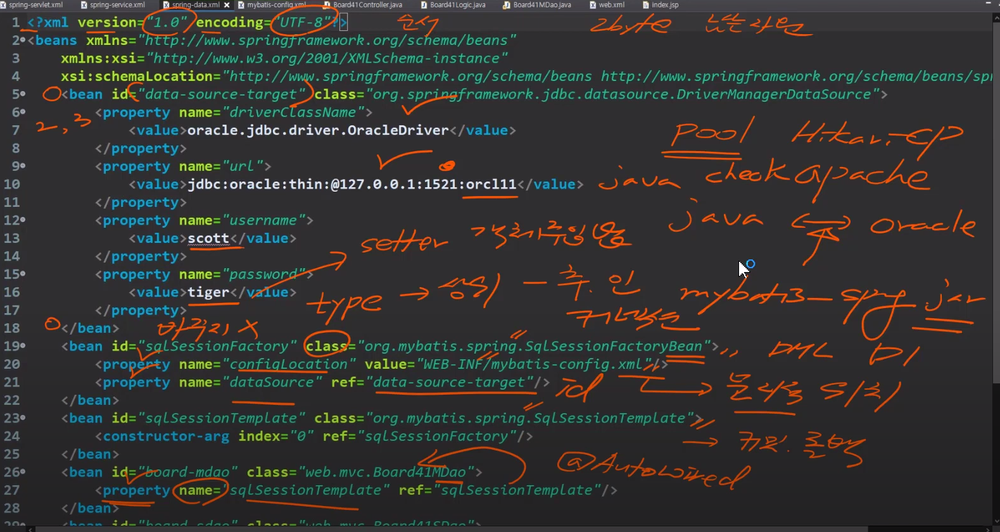

# 21/06/12

### Spring
#### spring-servlet.xml

* spring-servlet.xml : Controller, 응답페이지, 첨부파일 관련 처리, 고급기능 : 보안, 인증관련, 프론트개발자와 유저간의 인터셉트
* Spring은 Bean으로 클래스를 관리한다
* 라인6 : `BeanNameUrlHandlerMapping` : 이름으로 관리해서 메소드를 나누어서 처리하는게 불가능
* 라인21 : `SimpleUrlHandlerMapping` : url + 메소드 이름을 매핑처리 가능하다
* 의존(주입)관계 때문에 key와 value로 클래스 정보를 관리한다
* Beanfactory, Aplication Context가 빈을 관리한다
* `<bean id=~~~>` ====의존성 주입(DI, Dependency Injection)===>`<property name=~~~>`


* value -> 메소드 이름들(여기로 찾아간다)
* 라인59 : 응답페이지처리 -> viewResolver가 처리 -> ModelAndView와 연결
* preifx(접두어), suffix(접미어)의 처리 방법 2가지
  + java : 컴파일을 해야해서 버전 관리 어려움, 개발자 선호
  + xml : 버전 관리 쉬움, 전체적으로 볼 수 있어서 관리자 선호
#### spring-service.xml

* 버스정거장 정도의 역할로 보이지만 트랜잭션(Transaction)을 처리하고 AOP사상이담긴 프레임워크j를 사용해서 환경세팅한다
* 메소드 이름이 crudxxx, doxxx이런 형식으로 오면 TR처리로 일괄처리 `throw e;` 로 한다는데 추후학습예정
#### spring-data.xml

* 라인1 : xml 선언문 (버전과 인코딩 순서 변경도 불가능)
* 라인5~18 : 지금은 원시적인 형태, 컨넥션 pool로 변경하면 좋다
* 라인19 : class자리에 type(상위개념인 추상클래스, 인터페이스 가능)도 올 수 있다
  + 뒤에 Bean이 붙은것을 보고 mybatis의 spring.jar이 제공해주는 것을 알 수 있다
* `<bean id="sqlSessionFactory"~` : 커넥션 역할, 물리적으로 떨어진 오라클 서버와의 연결통로를 확보함
  + 회사정보, ip주소, s아이디, 계정 정보들이 필요하다
* 라인20 : DMl문장은 가지고 있는 물리적 위치 등록
* 처리 요청은 sqlSessionTemplate에서 한다, 커밋과 롤백도 고려 대상임
* 라인24 : Dao안에 27라인의 객체가 주입되어야 Dao클래스에서 Mybatis레이어와 소통이 가능하다
  + 부트는 @AutoWired로 처리 가능하다
* property name은 임의로 바꾸지 않는게 좋다
#### board.xml

* DOCTYPE : 일종의 선언문 해석하면 루트태그는 mapper로 시작해야한다, 버전3.0, 영어 .dtd(Tag 명세서)
* 라인 5 : log4j 설정에 필요한 값
* 라인 6~20 : resultmap은 join시 불편해서 기존의 map방식 사용이 추천됨
* 라인 21~26 : 게시판 글삭제시 사용하는 쿼리문
  + id로 구분함 `??? = #{value}` 형태
* 라인 27 : 글번호를 채번하는 문장
* 라인 28 : `/*` = 힌트문, NVL = 널 체크 함수, desc = 내림차순


* 라인 30 : 값이 Null이면 0으로 치환 후 1을 더해서 글번호를 채번한다 (학습용으로 이렇게 했지만 보통은 시퀀스(seq)를 쓴다)
* 라인 32 그룹 번호 : 계층형 게시판 구현을 위해 그룹번호가 필요하다
  - index문을 실행하기 위해 라인35의 늘 통과되는 멍청한 조건을 걸어준다
  - rownum : 스탑키 역할을 한다, 전체범위처리에서 부분범위처리로 바꿔줌
* 라인 38~43 : 마스터 테이블
* 라인 45~47 : 첨부파일 유무를 체크, 첨부파일이 있다면 subtable에 Insert해줌
* 라인 48~52 : 조회수

* 라인 53~58 : Step(순서) 업데이트문
  - 라인56~57 : UI에서 넘어와야 한다 (<from>전송을 해야한다)
  - 화면에 보이지 않는 값들 `<hidden = "bmg", bm.pos, bm.step` 
* 라인 59~68 : join이 일어난다
		69~74 : 맵으로 처리하는 select (test용 구문임)	   
# 21/06/11
node.js > 브라우저 없이 테스트하고 싶을 때 사용

### Bootstrap
+ 선이 생기던 문제는 `<hr>`을 사용해서 생긴 문제였다. 일단 `<div class="row">&nbsp</div>`를 대신 사용해서 해결했다 
+ 하위메뉴 넣기는 아래코드를 이용해서 해결 `collapse`를 사용해서 열고 닫기를 할 수 있다 
```html
        <a href="#demo" class="nav-link text-white" aria-current="page" data-toggle="collapse">
          <svg class="bi me-2" width="16" height="25">
            <use xlink:href="#home"></use>
          </svg>
          내정보
        </a>
        <div id="demo" class="collapse show"> <!-- 하위 메뉴 -->
          <ul class="collapse__menu">
            <a href="#" class="nav-link text-white">신상정보조회</a>
            <a href="#" class="nav-link text-white">신상정보수정</a>
            <a href="#" class="nav-link text-white">종합정보조회</a>
            <a href="#" class="nav-link text-white">본학기조회</a>
            <a href="#" class="nav-link text-white">수강성적조회</a>
          </ul>
        </div>
```
# 21/06/10

### Spring

+ 스크립트, ready 사용
+ #이 오면 유니크. 자바에선 protected, erd에선 PK
+ 실행문이 오는 자리 : 열거형 연산자(,) + 이벤트 처리 ②번
+ 부적절한 식별자 오류발생 > DML >SOL > Toad를 봐라
+ field > 컬럼명 : VO, 컬럼, key와 변수 이름을 똑같게 맞춰줘야한다
+ 41번라인
`<table id="dg_board" class="easyui-datagrid" data-options="url:'./jsonGetBoardList.sp4',toolbar:'#tb_board', url:'./jsonGetBoardList.sp4'"style="width: 1000px; height: 350px">`
  - data-options : 표준은 아니고 easyui에서 준 값
  - data-options 문법구조 => "이름 : '값', 이름2 : '값2' "


+ ready() >> xxx.sp4
+ 버튼 xxx.jsp >> js로 해야함(tag는 안된다)
+ 라인19~24, 함수선언 : <table 
+ 라인32-38, 초기화관련 >> lifecycle >> react
+ id값 앞에는 #붙인다
+ 콤마, 없으면 화면 깨진다
	
### Bootstrap
* 부트스트랩을 활용하여 반응형 웹페이지 loginpage와 mainpage 틀을 만들었다
* 뜬금없이 생긴 선과 mainpage 사이드바에 하위메뉴 넣기 실패

# 21/06/09
### JavaScript (ES6, ES11)
+ Object initializer(객체 초기자) : obj의 key와 value가 동일하면 하나로 쓸 수 있다.
+ Destructuring assignment (구조 분해 할당) : 배열,객체 사용 가능
+ Default parameters(기본값 매개변수)
```javascript
    function print(msg){
        if(msg==null){
            msg='default message';
        }
        console.log(msg);
    }
    print('hello');
    print();
    {
        function print(msg='default message'){        
            console.log(msg);
        }
        print('hl');
        print();
    }
```
+ Spread Syntax (전개 구문)
  - 배열을 복사하기
```javascript
const fruit1 = ['🍏', '🍈'];
const fruit2 = ['🍌','🍍'];
const fruits = [...fruits1, ...fruits2];
console.log(fruits);//Array["🍏","🍈","🍌","🍍"]
```
+ Optional Chaining 연산자 ?.는 체인의 각 참조가 유효한지 명시적으로 검증하지 않고, 연결된 객체 체인 내에 깊숙이 위치한 속성 값을 읽을 수 있다
```javascript
    {//노가다
        function print(worker){
            console.log(worker.job && worker.job.manager && worker.job.manager.name);
        }
        print(worker1);
        print(worker2);
    }
    {//추천
        function print(worker){
            console.log(worker.job?.manager?.name);
        }
        print(worker1);
        print(worker2);
    }
```
+ Nullish coalescing operator(널 병합 연산자) ?? : 왼쪽 피연산자가 null 또는 undefined일 때 오른쪽 피연산자를 반환하고, 그렇지 않으면 왼쪽 피연산자를 반환함
```javascript
	const name = '';
        const userName = name ?? 'Guest';
        console.log(userName);//""

        const num = 0;
        const message = num ?? 'undefinded';
        console.log(message);//0
```
### Bootstrap
+ 부트스트랩은 반응형이며 모바일 우선인 웹프로젝트 개발을 위한 가장 인기있는 HTM, CSS, JS 프레임워크 >> 웹사이트 개발 프레임워크
+ 표시 내용은 `<div class="container">` 안에 써야한다  
`<div class="container">` 태그는 내용 주위에 약간의 여백을 제공해주고, 이것이 없으면 콘텐츠가 윈도우의 끝까지 다 꽉차게 표시가되서 사용의미가 없어진다
+ "bootstrap.css"와 "bootstrap-theme.css", "jQuery"는 반드시 로딩해줘야 한다
```html
<link rel="stylesheet" href="./css/bootstrap.min.css">
<script src="./js/jquery-3.1.1.min.js"></script> 
<script src="./js/bootstrap.min.js"></script>
```

# 21/06/08
### JavaScript
* 객체 종류 3가지
  - 내장 객체 : 사용자 객체도 포함된다
  - 브라우저 객체모델 BOM : 브라우저 관련 객체로 브라우저와 관련된 정보를 얻거나 제어할 수 있게 해줌
  - 문서 객체 DOM : HTML 태그들을 객체화 한 것이며, 주로 HTML 페이지의 내용과 속성 등을 제어하기 위해 사용
* html
  - head : meta tag(검색엔진,포털사이트 정부 수집 용) ,view port, 인코딩타입, 호이스팅(hoisting)이 일어나는곳
  - body : 화면 출력 포지션
* 템플릿 리터럴 (내장된 표현식을 허용하는 문자열 리터럴)
  - 참고 : https://developer.mozilla.org/en-US/docs/Web/JavaScript/Reference/Template_literals
* 배열은 [], Object는 {}사용 할 것
* 일반 함수 정의방식과 익명 함수 선언 참조 방식의 차이점
  - 일반 함수 정의는 함수 호출 시 호이스팅(hoisting) 기술을 지원한다, but 익명 함수 선언 참조 방식은 호이스팅을 지원하지 않는다
  - 호이스팅을 적용하면 호출문이 함수 정의문 보다 먼저 나와도 호이스팅이 함수 정의문을 끌어올려서(head로) 함수를 호출한다
* 프로토타입(prototype) : 자바 static과 비슷한 기능으로 사용에 따라 메모리 할당을 줄일 수 있음
```javascript
function Person() {
  this.eyes = 2;
  this.nose = 1;
}
let kim  = new Person();
let park = new Person();
console.log(kim.eyes);  // => 2
```
↓이런식으로 변경 가능
```javascript
function Person() {}
Person.prototype.eyes = 2;
Person.prototype.nose = 1;
let kim  = new Person();
let park = new Person():
console.log(kim.eyes); // => 2
```

* function(함수) : 코드를 잘 정리정돈하기 위한 도구
  - function 사용의 장점
    + 코드의 유지보수가 쉬워진다, 하나의 함수를 여러곳에서 사용할 때 다 바꿀 필요없이 함수만 바꾸면 됨
    + 코드의 길이가 짧아진다, 같은 코드의 반복을 없애고 웹페이지의 크기가 작아져서 전송에 유리해짐
    + 함수를 사용하면 두 코드가 논리적으로 같다는 것을 알 수 있고, 적절한 이름을 붙여주면 이 코드가 어떤 일을 하는지 한 눈에 알 수 있다
  -  return : 함수내부에서 처리한 결과값을 밖으로 내보내는 역할을 하는 일종의 출력값
  -  retrun을 이용하여 값을 돌려줄 수 있고, 함수 탈출(종료) 용도로 사용 가능
  -  함수를 사용할 때 this로 태그를 전달해주고, 이를 함수는 매개변수로 받아 사용 가능
  -  매개변수(Parameter) : i,j 인자(Argument) : 2,3
```javascript
function hello(i, j) {
  document.write(i + j);
}
hello(2, 3);
```
### Spring
```
INSERT INTO board_master(bm_no,bm_title,bm_writer,bm_content,bm_date,bm_hit,bm_group,bm_pos,bm_step,bm_pw,bm_email)
VALUES(#{bm_no},#{bm_title},#{bm_writer},#{bm_content},#{bm_date},#{bm_hit,#{bm_group},#{bm_pos},#{bm_step},#{bm_pw},#{bm_email})
VALUES(SELECT 문.......)
```
`localhost:9001/board/boardInsert.sp4?bm_no=100&bm_title=제목&bs_file=a.txt&bm_writer=김철수&bm_email=test@hot.com&bm_content=글내용&bm_pw=123`

# 21/06/07
### HTML
* index.html파일 안에 `<link rel="stylesheet" href="파일이름.css">`으로 스타일.css와 연결해줘야 적용됨
* grid를 이용해 화면 영역 나누기
1. 화면 영역을 나눠주고
```css
.main-container {
  width: 1080px;
  margin: auto;
  display: grid;
  grid-template-columns: repeat(3, 1fr); /* 균일한 크기로 3등분 */
  grid-template-rows: repeat(24, 40px); /* 40px로 24등분 */
  gap: 10px;
}
```
2. 클래스별 속성 생성 후
```
.box-one {
  grid-column: 1 / 3; /* 나눈 영역을 지정해줘서 영역 크기 설정 */
  grid-row: 1 / 3;
}
.temp-box {
  background: skyblue;
  text-align: center;
  font-size: 30px;
  border: 1px solid #010102;
}
```
3. `<div class="temp-box box-one">1</div>` 이런식으로 적용해주면 끝

### JavaScript
* 구조
  - <head> CSS, JavaScript, Jquery, 공통코드들(include)
  - <body> DOM Tree
  - `$(document).ready(function {     });`    >>> $:Jquery 기반 	
* `document.write("내용");` >>> document = html문서, write = 함수
* if문
```javascript
function test() {
          if (true && true) {
            document.write("같다.","<br>");
          }
          else {
            document.write("다르다.");
          }
        }
```
* 배열 : 3가지 방법으로 선언 가능
	- `document.write(d3.length);` : 배열 길이 출력도 가능, 3 출력됨
	- d3.push("coconut");` :  배열의 맨 뒤에 coconut 값 추가
```javascript
function test() {
	const d1 = new Array();
	d1[0] = 30;
	d1[1] = "닌텐도";
	d1[2] = true;
	const d2 = new Array(50, "태블릿",false);
	const d3 = [90,"핸드폰",true];
```
* 비교연산자
	- === : 동등, html에서는 `&lt;`는 < 를 의미하는 것이고, `&gt;`는 > 를 의미한다
* 리팩토링 : Javascript에는 자기 자신을 가리키기 위한 this를 사용 가능하다


# 21/06/06
### JavaScript
* Javascript의 가장 중요한 역할는 사용자와 상호작용 하는 것, 이러한 Javascript의 특성을 이용해서 우리는 웹페이지를 더 동적으로 만듬
* HTML의 script 태그 안에는 Javascript 코드 사용, 동적으로 다양하게 출력가능 <-> HTML 코드 정적 문자 그대로를 출력
* alert('경고내용') : Javascript 경고창 띄워주는 명령어 (이벤트 조건 만족 시 '경고내용' 경고창이 뜸)
  - 구조 : alert('hi')
* 콘솔 창으로 Javascript 코드를 실행가능, alert를 예시로 들면 현재 페이지에서 바로 경고창으로 출력가능
* 스타일으로 색 변경 가능 ex) style="background-color: black; color: white;"
* div와 span : CSS나 Javascript 코드를 삽입하기 위해서 존재하는 태그
  - div 태그는 화면 전체를 사용하기 때문에 줄바꿈이 되고, span은 줄바꿈이 되지 않음
* js 클래스를 만든 후 안에 속성 넣고, html코드에 적용 가능
```css
 .js {
        font-weight: bold;
 }
```
```javascript
<span class="js">Javascript</span> is wonderful!
```
* 클래스 대신 id도 사용 가능한데 id는 한 페이지에서 딱 한번밖에 못 씀
```css
 #first {
    color: green;
 }
```
* 우선 순위는 id > class > 태그
  - 이를 이용해 class 위에 id를 얹어서 구현가능 (class로 광범위한 효과를 주고, id를 이용해 그것 만 예외적으로 디자인 변경 가능 )
* querySelector("찾을내용") : 원하는 태그를 선택해줌
  - 구조 : documnet.querySelector("body").style.backgroundColor = 'black';

### 넥사크로
* 프로젝트 생성 후 작업 환경 세팅, 톰캣 서버 연동 복습
* 간단하게 ui화면 그리기


# 21/06/05
### 넥사크로

+ Tools-options-Generate
  - 경로 D:\nexacro\nexa_test\WebContent 지정 (이클립스 작업폴더)
  - select browser 설정은 크롬만 체크
+ ctrl+F1 넥사크로 매뉴얼
+ nexacro 교재 4. 화면 개발 실습 중요
  - 55p 화면 생성 레이아웃 - 신규 화면 생성시 OOO.xfdl
+ Select바 Grid - 그리드(화면) 하나 그려줌
+ Select바 Dataset - Dataset 생성 ex)de_emp
  - Dataset Editor - colurms - add로 컬럼 추가
  - 드래그앤 드롭 방식으로 추가
  - Dataset Editor - row - add로 테이블 내용 추가 가능(로우 추가)
+ 자바 > 넥사크로 (구조)
  - table tag > grid
  - json > dataset
  - DataSet ds_emp = new DataSet(); > binddataset="de_emp"

### eclipse 오류
import로 복사한 프로젝트 등록할때 already Exist뜨면  
복사한프로젝트폴더/.project로가서 <name>기존프로젝트이름</name>을 <name>작업할 프로젝트이름</name>으로 수정

# 21/06/04
### 넥사크로

+ 넥사크로 도입
  * pojo, spring 같이 o boot는 x
  * Libraries 빌드패스잡아줘야함
  * xml 화면 : Grid 
  * DataSet 실제 데이터를 가지고있는 구조체(데이터집합) > nexacro.jar~ 제공
+ 자바 프로젝트와 연결
  * WebContent-nexa17 : 
  * App-Desktop.xadl.js >> 메인파일  
  * nexacro/17/project/kosmo80안 파일을 dev_nexa/WebContent/nexa에 배포함
+ design-화면, source-xml, script-event 역할
+ 넥사크로 메뉴
  * Tools 물리적인 경로 등록
  * Generate - Application 배포(배치)작업
+ 퀵 뷰바(돋보기라인)
  * 돋보기버튼 - 실행(설정바꿔서 톰캣으로 실행가능)
  * file 아래아래 바 넥사크로 제공 컴포넌트
+ 작업영역  
  * TOP - 도구창들
  * LEFT - 파일목록
  * RIGHT - 작업화면
  * 오른쪽 창 - 이벤트 설정
+ WebContent-deptManager.jsp, empManager.jsp, 툼캣서버포트, 넥사크로-TypeDefinition-service 전부 포트를 똑같이 설정해줘야 연결됨
  * 9000포트는 거르자 (다 똑같게 세팅해둬도 안되는 사람들이 많았음)

# 21/06/03
### Spring

1. 요청이 올 때 (예시는 http://localhost:9001/board/getBoardList.sp4)
2. 프론트 컨트롤러인 Dispatcher 서블릿이 처리 후 적절한 세부 컨트롤러한테 작업을 뿌려준다  
WebContent/WEB-INF/web.xml
```html
	<servlet>
		<servlet-name>appServlet</servlet-name>
		<servlet-class>org.springframework.web.servlet.DispatcherServlet</servlet-class>
		<init-param>
			<param-name>contextConfigLocation</param-name>
			<param-value>/WEB-INF/spring-servlet.xml</param-value>
		</init-param>
		<load-on-startup>1</load-on-startup>
	</servlet>
  ```
3. xxx.sp4니 spring-servlet.xml로 보내서  
WebContent/WEB-INF/web.xml
```html
	<servlet-mapping>
		<servlet-name>appServlet</servlet-name>
		<url-pattern>*.sp4</url-pattern>
	</servlet-mapping>
```
4. 또 분류에 따라 board-controller로 이동  
WebContent/WEB-INF/spring-servlet.xml
```html
	<bean id="url-mapping" 
	class="org.springframework.web.servlet.handler.SimpleUrlHandlerMapping">
		<property name="mappings">
			<props>
				<prop key="/board/getBoardList.sp4">board-controller</prop>
				<prop key="/board/jsonGetBoardList.sp4">board-controller</prop>
			</props>
		</property>
	</bean>
```
5. board-controller로 와서 코드가 시킨 board-logic을 참고, 클래스 web.mvc.Board41Controller.java 참고  
WebContent/WEB-INF/spring-servlet.xml
```html
	<bean id="board-controller" class="web.mvc.Board41Controller">
		<property name="methodNameResolver" ref="board-resolver"/>
		<property name="boardLogic" ref="board-logic"/>
	</bean>
```
6.board-mdao & board-sdao 참고, 클래스 web.mvc.Board41Logic.java 참고  
WebContent/WEB-INF/spring-service.xml
```html
	<bean id="board-logic" class="web.mvc.Board41Logic">
		<property name="boardMDao" ref="board-mdao"/>
		<property name="boardSDao" ref="board-sdao"/>
	</bean>
```
7. 계속 경로 참조해서 오라클 접속  
WebContent/WEB-INF/spring-data.xml
```html
	<bean id="data-source-target" class="org.springframework.jdbc.datasource.DriverManagerDataSource">
		<property name="driverClassName">
			<value>oracle.jdbc.driver.OracleDriver</value>
		</property>
		<property name="url">
			<value>jdbc:oracle:thin:@***.0.0.1:1521:orcl11</value>
		</property>
		<property name="username">
			<value>*****</value>
		</property>
		<property name="password">
			<value>*****</value>
		</property>
	</bean>
	<bean id="sqlSessionFactory" class="org.mybatis.spring.SqlSessionFactoryBean">
		<property name="configLocation" value="WEB-INF/mybatis-config.xml"/>
		<property name="dataSource" ref="data-source-target"/>		
	</bean>
	<bean id="sqlSessionTemplate" class="org.mybatis.spring.SqlSessionTemplate">
		<constructor-arg index="0" ref="sqlSessionFactory"/>
	</bean>
	<bean id="board-mdao" class="web.mvc.Board41MDao">
		<property name="sqlSessionTemplate" ref="sqlSessionTemplate"/>
	</bean>
	<bean id="board-sdao" class="web.mvc.Board41SDao">
		<property name="sqlSessionTemplate" ref="sqlSessionTemplate"/>
	</bean>
```
8. 오라클에서 값 받아오고 돌아와서  
WebContent/WEB-INF/mybatis-config.xml
```html
 <typeAliases>
 	<typeAlias alias="bmVO" type="com.vo.BoardMVO"/>
 	<typeAlias alias="bsVO" type="com.vo.BoardSVO"/>
 </typeAliases>
 <mappers>
 	<mapper resource="com/mybatis/mapper/board.xml"/>
 </mappers>
```
9. board-logic로 오고
10. board-controller 와서
11. 컨트롤러에서 다시 Dispatcher 서블릿으로  
WebContent/WEB-INF/spring-servlet.xml  
```html
	<bean id="board-controller" class="web.mvc.Board41Controller">
		<property name="methodNameResolver" ref="board-resolver"/>
	</bean>
```
12. board-resolver로 와서  
WebContent/WEB-INF/spring-servlet.xml
```html
	<bean id="board-resolver" class="org.springframework.web.servlet.mvc.multiaction.PropertiesMethodNameResolver">
		<property name="mappings">
			<props>
				<prop key="/board/getBoardList.sp4">getBoardList</prop>
				<prop key="/board/jsonGetBoardList.sp4">jsonGetBoardList</prop>
			</props>
		</property>
	</bean>
```
13. 경로 지정해주고 뒤에 jsp붙여줘서 숨어있는? WEB-INF/views/board/getBoardList.jsp를 불러왔다  
WebContent/WEB-INF/spring-servlet.xml
```html
	<bean class="org.springframework.web.servlet.view.InternalResourceViewResolver">
		<property name="prefix" value="/WEB-INF/views/"/>
		<property name="suffix" value=".jsp"/>
	</bean>
```
