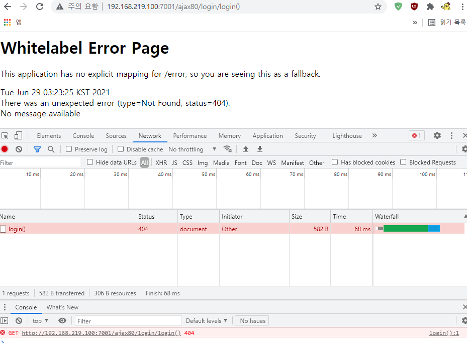

# 21/07/13
### Android Studio (Kotlin)
Numberpicker : 숫자 선택 
```kotlin
private val numberPicker: NumberPicker by lazy {
        findViewById(R.id.numberPicker)
}
override fun onCreate(savedInstanceState: Bundle?) {
        super.onCreate(savedInstanceState)
        setContentView(R.layout.activity_main)
        numberPicker.minValue = 1
        numberPicker.maxValue = 45
}    
```
min : 최소값, max 최대값 설정
# 21/07/11
#### 파이널 프로젝트 작업
웹사이트를 앱화면에서 띄울때 버튼, 화면 등등 깨지는걸 해결하기 위해서 웹뷰 설정도 바꿔보고 비율맞추는 함수 등을 써봤지만 결과가 다 시원찮다.
안드로이드 스튜디오에서는 해결할 수 없는 것 같아서 자바 스프링 쪽에서 앱 전용 화면을 다시 그리는 중


# 21/07/08
#### 파이널 프로젝트 작업
+ WebView를 이용해서 프래그먼트화면에 인터넷 창과 연결했다
+ AndroidMainifest.xml에 `<uses-permission android:name="android.permission.INTERNET"/>`빼먹어서 인터넷 연결 안 됨

+ 웹 화면이 앱 안에서 뜨는게 아니고 새창으로 나와서 `mWebView.setWebViewClient(new WebViewClient());` 추가해서 프래그먼트 밖으로 못나가게함

+ 근데 인터넷 연결이 또 안되서 AndroidMainifest.xml에 `android:usesCleartextTraffic="true"` 추가해주니 정상적으로 작동한다

### Android Studio
+ 직렬화추가 : build.gradle(app)-plugins에 `id 'kotlin-parcelize'` 추가
+ 룸 컴파일러 의존성 주입 : build.gradle(app)-plugins에 `id 'kotlin-kapt'` 추가
```kotlin
//NullSaft 한 코드를  사용하기 위해서 non-null Type으로 변수를 선언한다
//초기값이 없는 변수는 어떻게 초기화를 해야할까?
//초기값이 없으면 변수 선언 자체가 안되는데
var //배리어블
nullabeNumber: Int? = null
val //밸류 : 상수

lateinit var lateinitNumber: Int
//추후에 초기화하는 코드가 반드시 와야한다
lateinitNumber = 10 //초기화
//사용할 때
nullabeNumber?.add()
lateinitNumber.add()
//자바의 경우
Integer a = 100;//(java)
a = null;//wrapper class (java)
a.sum();//NullPointerException 맞아버림 (java)
//null safe한 코드를 작성하는 것 개발자 책임이니까 (java)
if(a != null) a.sum();//이런식으로 null을 피한다(java)
//하지만 코틀린은?
val b: Int? = 100 // null일지도? (Kotlin)
val c: Int = 100 // null safe한 코드를 구성해야 한다(Kotlin)
b?.sum()//null이면 아예 실행을 안한다(Kotlin)


```
+ ↳ Kotlin vs Java
+ Kotlin 특징
  + extends가 없음, :변수? nullabel, 이벤트처리를 람다식으로 한다
  + 5교시 2:59내용


# 21/07/07
### Android Studio
**Firebase Android Studio 연결**
+ build.gradle(app)에서 application ID 확인 `id 'com.android.application'`
+ 파이어베이스 프로젝트 생성 후 안드로이드 등록 클릭 후 ID값 등록
+ Project로 변경 해서 app폴더에 google-services.json 넣어주기
+ build.gradle에 Firebase SDK 추가해주기

#### 트러블 슈팅(Android Studio)

+ 문제 : 강좌목록 버튼 클릭시 CourseFragmant 화면이 나와야 하는데 멈춰버린다
+ 원인 : fragmentCourse 객체선언을 안해서 index값이 전달안되고 null object reference가 뜬 듯?
+ 해결 : MainActivity.java의 onCreate메소드 아래에 `fragmentCourse = new CourseFragment();`를 추가해서 해결
#### 파이널 프로젝트 작업
+ 프래그먼트 화면 간에 이동할때는 직접 이동할 수 없고, 주인 액티비티를 거쳐서 가야한다
  + HomeFragment fragmentHome; 선언 후 
  + onCreate 메소드 아래에 fragmentLogin = new LoginFragment(); 객체를 만든다
  + onFragmentChange메소드 아래에 `getSupportFragmentManager().beginTransaction().replace(R.id.container, 이동할Fragment).commit();`로 이동한다.
    + onFragmentChange() : 지금 화면에 올라온 프래그먼트가 아니라 다른 프래그먼트를 띄우도록 하는 메소드
+ 메인엑티비티.xml에 FrameLayout을 추가해서 화면을 갈아낄 영역을 만들어준다
  + 액티비티의 FrameLayout을 액자개념이라 생각, 갈아끼는 사진은 Fragment 화면들 
+ 앱 시작 후 처음보여지는 화면을 특정 프래그먼트로 지정하기
+ ↓↓↓ 메인엑티비티.xml의 FrameLayout에 원하는 화면의 fragment를 넣어주면 된다
```xml
<FrameLayout
        android:id="@+id/container"
        android:layout_width="match_parent"
        android:layout_height="match_parent"
        android:layout_below="@+id/toolbar">
    <fragment
        android:name="com.example.paprika.원하는Fragment"
        android:layout_width="match_parent"
        android:layout_height="match_parent"/>
</FrameLayout>
```
# 21/07/06
### Android Studio
앱바레이아웃 소개
리니어 레이아웃 안에 앱바레이아웃, 툴바, (탭레이아웃, 뷰페이저) 사용 예정
페이지 구성 액티비티 1장 MainActivity
HomeFragment, ListFragment 사용페이지 : (PizzaFragment, PastaFragment, StoreFragment)
findViewById : xml에 있는걸 불러온다
글자크기는 보통 sp를 사용한다
### Ajax
jsonObject{" "}

# 21/07/05
json형식, 자바에서 배운 리스트나 맵, 스크립트에서 스프링디파인, 파스, 파서함수 등을 써서 하나씩 꺼낼줄 알고 배열로 컨버전, 자료구조로 컨버전을 자유롭게
### Android Studio
* jcenter지원이 중단되어서 build.gradele(Project)-allprojects-jcenter 행 삭제해야 한다(manven이 역할 대신 수행)
* Launcher Activity : 메인 액티비티로 쓰겠다, Generate ad Layout File : layout에 xml파일 같이 생성
* 디버거모드 : Run-Attach Debugger to Android Process(톱니바퀴 모양)
* ListFagment : layout 필요없음, Dataset이 필요(json, Room, workout.java 같이 직접가져오는 소스 설계로 대체 가능) >> Adapter로 처리(매핑)
* List 클릭 시 이벤트 감지를 itemClicked(int id필요:순서역할) 이벤트 핸들러 메소드로 처리가능
```java
    @Override
    public void onAttach(Context context){
        super.onAttach(context);
        this.listener = (Listener)context;
    }
```
* ↳ onAttach 함수로 context를 초기화하고 this.listener에 담을 수 있음
* AndroidX 정보 : https://developer.android.com/jetpack/androidx?hl=ko
* drawable-New-Vector Asset : 안드로이드에서 제공되는 이미지(프로그램관련) 사용 가능
* 코틀린 문법 파악
  * 생성자, 인터페이스, 추상클래스 구조를 알아야한다
  * 이벤트 처리 방법 내부클래스, 익명클래스, 람다식 3가지도 알아야함
# 21/07/03
DataGrip 툴을 써서 테이블에 유의미한 테이터를 넣는 작업을 했는데 생각보다 오래걸린다

### Android Studio

+ match_parent
  + 부모가 가지는 길이를 모두 채울 때 사용한다
  + 해당 레이아웃을 취하는 컨테이너의 길이를 모두 채우는 것 
+ wrap_content
  + 해당 뷰가 그려질 수 있게 필요한 길이만 사용한다
  + 절대적인 값도 넣을 수 있는데, 10px, 10dp, 10sp 처럼 수치와 단위를 써서 직접 길이 값을 지정하면 됨

# 21/07/01
### Android Studio
+ 부모액티비티 설정 : `<activity android:name=".HelpActivity" android:parentActivityName=".MainActivity"/>`
+ 디바이스들의 화면 사이즈가 조금씩 다름 > 이런점을 프래그먼트로 처리해야 한다


#### 트러블 슈팅(Android Studio)

+ 문제 : 이미지를 imageview로 추가했는데 화면에 안나옴
+ 원인 : 위에 textview의 height 속성을 match_parent로 줘서 화면을 다 차지했던 것
+ 해결 : `android:layout_height="wrap_content"`로 바꿔서 해결

# 21/06/30
### Android Studio
+ AndroidManifest.xml-manifest 안에`<uses-permission android:name="android.permission.INTERNET" />` 추가
+ AndroidManifest.xml-manifest-application 안에`android:usesCleartextTraffic="true"` 추가
+ Logcat info로 설정
+ 라이프사이클: https://developer.android.com/guide/components/activities/activity-lifecycle#java
+ 프래그먼트 관리 : https://developer.android.com/guide/fragments/fragmentmanager#java
```java
public void resList(View v){
        Log.i(this.getClass().getName(),"resList"+v);
        Intent intent = new Intent(this, ResListActivity.class);
        startActivity(intent);
    }
```
+ ↳ 다른 액티비티로 화면 이동 코드

액티비티 코드가 해야 할 일
1. 드로워 토글 추가하기
2. 클릭에 응답하도록 드로워 구현하기
3. 사용자가 Back버튼을 클릭했을때 드로워 닫기


# 21/06/29
### Ajax
+ ajax는 페이지 갱신x >> 세션과 쿠키의 정보를 새로 가져오는데 함정 생김 >> 그래서 include로 가져와야한다
  + @include : 전체적인 갱신, 소스가 하나로 합쳐진다 = java가 새로 만들어진다 >> 컴파일이 일어난다 >> response가 새로 만들어지고 request가 새로 할당된다 
  + jsp:include : 모체가 되는 jsp가 있음, jsp:include 수정 후 모체 jsp도 수정해줘야 적용된다
+ 꼭지점 부분부터 확대 이미지 시작되게 구현 << mouseover(xxx)물리적인 정보를 알려고 사용
+ mouseout시 지우기 기능
+ parameter 활용을 자유자재로 하자 (DI, 게으른 인스턴스화)
  + return 타입으로만 처리하기 보다는 parameter로 처리를 해보자
+ **@Controller vs @RestController**
  + @Controller : jsp와 연결 - redirect, forward
    + 리턴 타입 : string, void
  + @RestController : ajax, react, nexacro들이 사용
    + Data를 받아온다 > 동적이다
    + 리턴 타입 : string, void(올 수는 있지만 쓸 이유가 없다. void 쓸거면 @Controller써라)
    + forward 필요없음, String >> json, xml  

pictureMain.html
```javascript
   var xhrObject = null;//전역변수 선언
   var el;//이벤트가 발생한(td태그) 객체정보를 담기
   function createRequest(){
       try{
           xhrObject = new XMLHttpRequest();//비동기통신 객체 생성
       }catch(trymicrosoft){
           xhrObject = null;
       }
       if(xhrObject==null){
           alert("비동기 통신객체 생성 실패!!!");
       }
    } 
    //서버로 요청에 대한 처리를 전송함 - 비동기로 처리하기로 함.
	function startMethod(td){//td - tag, element, node  ==> Object
    	//전역변수 el 초기화(td의 정보를 el갖게됨.)
			el = td;
		//그림 제목에 마우스를 오버 했을 때 td태그에 정의한 아이디값을 가져오는 코드
		createRequest();//비동기통신 객체 생성 메소드 호출 - 전역변수로 초기화됨
		//콜백메소드 이름 선언
		xhrObject.onreadystatechange = popup_process;
		//옵션 추가
		//1)전송방식 - GET[query string,링크,제약,노출]|POST
		//2)목적지 - 요청을 누가처리하지? - XXX.jsp(오라클통신,자바코드활용,데이터)
		//3)옵션 - true:비동기처리, false:동기처리
		var url="./pictureInfo.jsp?p_no="+td.id;
		xhrObject.open("GET",url,true);
		//전송
		xhrObject.send(null);
	}
```
+ xhrObject : XMLHttpRequset를 담는 변수, jQuery 사용시 생략 가능(function createRequest도)
+ td : 위치정보를 얻어오기 위해 사용, 오브젝트 이므로 this로 받아야함
+ createRequest : XMLHttpRequest 생성
+ onreadystatechange : 상태가 0→1→2→3→4
  + 처음 시작이 0, 1번 부터 시작, 2→3 넘어갈때 header는 결정되있고 body만 바뀜, 3은 다운로드 중, 4는 다운로드 완료
  + jQuery시 success:function(data){}쓰면 되서 필요없어짐
+ popup_process : 콜백 메소드
`error:function(e){}` : 여기서 e는 비동기 통신 객체, XMLHttpRequest임

### Android Studio
액티비티에서 프래그먼트 태그 사용 : 정적  
xml 레이아웃을 가지고 프래그먼트 매너지와 프래그먼트 트렌젝션을 사용 : 정적
+ 툴바에서 자식 노드가 없으면 나눠쓰기x (/>로 끝내란 뜻)
+ **툴바를 추가하는 방법**
1. build.gradle의 dependencies에 androidx패키지 toolbar추가 (지원라이브러리 : `implementation 'androidx.appcompat:appcompat:1.3.0'`)
2. Main액티비티가 AppCompatActivity를 상속받음 `public class MainActivity extends AppCompatActivity`
3. 기본 앱바를 제거(thems.xml에 있는) `<style name="Theme.ActionBar80" parent="Theme.AppCompat.Light.NoActionBar">`
4. 툴바를 레이아웃에 추가 : toolbar_main.xml 추가
5. MainActivity onCreate메소드에 툴바를 액티비티의 앱바로 사용하도록 갱신 처리 ↓
```java
Toolbar toolbar = findViewById(R.id.toolbar);
setSupportActionBar(toolbar);
```
+ **액션을 앱바에 추가하는 방법**
1. 액션의 아이콘과 텍스트로 사용할 리소스를 추가한다
2. 메뉴 리소스 파일에 액션 정의하기
3. 앱바에 메뉴 리소스를 추가하도록 액티비티에 지시하기 : onCreateOptionsMenu()
4. 클릭했을 때 어떤 액션을 수행할지 코드로 정의하기 : onOptionItemSelected()
+ orderIncategory : 앱바가 여러 액션을 포함할 경우 액션이 나타나는 순번
+ 라이프사이클 콜백함수 사용시 super 붙이기
+ 프래그먼트 콜백
  + onAttach() : 프래그먼트가 액티비티에 연결되었을 때
  + onCreate() : 프래그먼트 초기화
  + onCreateView : 레이아웃 inflater로 자신의 뷰를 만든다 (xml이용)
  + onActivityCreated : onCreate 메소드가 완료되면 호출

# 21/06/28
### Android Studio
* `<uses-permission android:name="android.permission.INTERNET" />` : 인터넷 사용에 대한 퍼미션 처리 부분
* `android:usesCleartextTraffic="true"` http를 지원하지 않아서 이에 대한 옵션값
  * 이게 있어야 안드로이드를 통해서 http 페이지 확인 가능
* WebView API : 사용하려면 반드시 http에 대한 옵션 설정이 추가되야함
* 선형 레이아웃에서는 `android:orientation="vertical"`옵션 반드시 추가
  * vertical: 수직의(세로로 쌓인다), horizontal : 수평의(가로로 쌓임)
* match_parent : 크기가 부모 사이즈 전체를 다 차지함
* 하이브리드 앱에 필요한 부분
  *  json활용을 위한 의존성 주입 Gson : `implementation 'com.google.code.gson:gson:2.8.2'`
  *  http서비스를 백그라운드에서 지원해줄 의존성 주입 volley :`implementation 'com.android.volley:volley:1.2.0'`
* 로그인 처리 성공하면 intent > 새로운 액티비티로 이동해야함 > 메인액티비티 호출
* setOnClickListener : 이벤트를 듣는 인터페이스를 직접 내부 클래스로 처리
* id와 pw를 사용자로 입력 받은 값으로 바꿔주려면 안드로이드는 toString을 입혀서 컨버전을 시켜줘야 담을 수 있음
  * `final String id = et_id.getText().toString();`, `final String pw = et_pw.getText().toString();`
* 메뉴에 들어갈 소스(아이템) 넣기
  * res우클릭-New-Android Resource Directory 디렉토리 생성 후 우클릭-New-Menu Resource File
* WebView로 처리하는 페이지
  * 컴포넌트 이름을 WebView로 바꿔줘야한다
  * 웹뷰에 접근을 해야하는데 단독화면이 아니라 액티비티에 포함된 화면이므로 View를 통해서 받은 후 접근해야한다
  * `wv_web.loadUrl("https://www.naver.com");` 이런식으로 홈페이지를 프래그먼트에 띄울 수 있다
### Ajax
* 검색자동완성기능 => Ajax
* `url:"./cookieDelete.jsp?cname=cname&timestamp="+new Date().getTime(),` : 밀리세크단위로 값을 찍어서 인터셉트 안당함
#### 트러블 슈팅(Ajax)

+ 문제 : 로그인 버튼 클릭시 에러발생, 화면에 구글지도가 안뜸
  + 원인 : ajax를 써서 페이지 이동없이 결과만 나와야하는데 페이지가 이동된다
  + 해결 : `<a id="btn_login" href="login()" ~생략~>`을 `<a id="btn_login" href="javascript:login()"~~>`로 바꿔서 해결
  + 지도 안나오는 부분은 reay, documet 오타를 ready, document로 바꿔주니 정상 작동함


+ 문제 : 위에 문제를 해결하니 새로운 에러 발생
  + 원인 : 입력한 id와 pw 값을 제대로 못 가져간다. 콘솔창 확인하니 `value : {mem_idtest1=, mem_pw123=}` 이런식으로 이상하게 값을 가져감
  + 해결 : `let param = "mem_id"+u_id+"&mem_pw"+u_pw;`을 `let param = "mem_id="+u_id+"&mem_pw="+u_pw;`로 바꿔서 해결
#### 쿠키
+ 쿠키는 클라이언트 측에 저장된다. 타입은 text
+ 쿠키는 생성한 후 반드시 클라이언트쪽으로 내려야한다. `response.addCookie(주소번지);`
+ 쿠키는 삭제할 때도 반드시 인스턴스화 해야한다.
+ 서버에서 쿠키를 읽어 올때는 request 사용
+ 쿠키를 사용하는 경우 보안상 중요하지 않거나(장바구니,찜목록) 임시저장할때
+ 쿠키 생성 : `Cookie c1 = new Cookie("notebook", "gram");`
+ `c1.setMaxAge(30);` : 쿠키의 유효시간을 초 단위로 지정함. 음수 입력시 웹 브라우저를 닫을 때 쿠키가 자동삭제됨
+ `c1.setPath("/");` : 쿠키는 특이하게 경로를 지정할수있다. path경로가 다르면 접근할 수 없다
+ 쿠키 c1 삭제 하는법
  + `Cookie c1 = new Cookie("notebook", "");` : 똑같은 쿠키를 만든 후 빈 문자열을 주고
  + `c1.setMaxAge(0);` : 0을 주면 파기됨
  + `response.addCookie(c1);` : 응답으로 반드시 내려야함
+ 부트스트랩이나 스크립트 기반의 솔루션 사용시 jquery에서 제공하는 쿠키 api가 더 편리하다              
```java
Cookie cookies[] = request.getCookies();
for(int i=0;i<cookies.length;i++){
	out.print(cookies[i].getName()+". "+cookies[i].getValue());	
}
```
 ↳ 쿠키 읽어오는 코드 
# 21/06/26
### GitHub
**Git Repositoriy commit 유지하면서 병합하기**
+ 메인 레포 : project1, 합쳐질 레포 : project2

+ 합쳐질 레포 폴더 경로에서 
+ git remote -v로 url 주소 복사 : https://github.com/깃아이디/합쳐질레포이름.git 이런식으로 나옴

+ 메인 레포 폴더에 가서
+ git remote add project2 https://github.com/깃아이디/합쳐질레포이름.git 입력
+ git fetch project2
+ git merge --allow-unrelated-histories project2/main(브랜치 이름, 따로 안 만들었으면 main임)
+ git remote remove project2 해주면 합쳐진 Repositoriy의 커밋 이력까지 병합 완료

# 21/06/25
### Ajax
+ POJO 서블릿 의존 100%
  + response가 있어야 페이지 이동 가능 res.sendRedirect + "a.jsp"
+ boot 
  + retrun "redirect:a.jsp , "forward:a.jsp
+ jsp : Tomcat이(servlet.jar, jsp.jar) session을 내장 객체로 주입해준다. 인스턴스화 없이 바로 사용가능
  + @RequestMapping 공통일때 사용
  + @GetMapping, @PostMapping 구체적으로 메소드와 연계해서 처리(반복되는 코드 줄이고 일괄처리)
+ 파라미터를 이용해서 사용자가 입력한 값을 화면없이도 get방식을 이용해 단위테스트 할 수 있다
+ 값 노출이 안 되야 할 때는 post방식으로 변경  

#### 세션
+ 별도로 session을 선언 : HttpSession Session = req.getSession();
+ 직접 내용 담음, 여러 담기 가능(이름은 달라야함) : session.setAttribute("이름","값")
+ 가져올때는 session.getAttribute("이름")
+ 웹 컨테이너는(툼캣,j부트, 웹스피어와 같은 엔터프라이즈서버) 기본적으로 한 웹 브라우저마다 한 세션을 생성한다
+ 쿠키가 클라이언트 측의 데이터 보관소라면, 세션은 서버(Cache Memory)측의 데이터 보관소이다
+ 쿠키처럼 세션도 생성을 해야 정보를 저장할 수 있다
+ getId() :세션의 고유 아이디 확인
+ getCreationTime() : 세션 생성시간 확인
+ getLastaccessedTime() : 웹 브라우저가 마지막에 세션에 접속한 시간 확인
+ session.invalidate() : 전체 삭제, 로그아웃 버튼이 눌렸을때 사용
+ session.removeAttribute("") : 부분 삭제
+ 안드로이드에서는 세션과 쿠키를 사용할 수 없다
```jsp
<%
	String s_name = null;//변수선언
	s_name = (String)session.getAttribute("s_name");//세션에서 내장객체 가져옴
%>
        <label for="msg">
          	<font color="white"><%=s_name %>님 환영합니다.</font>
        </label>
```
 ↳ 세션에서 가져온 값 적용

# 21/06/24
네트워크, 통신, 스레드, db연동, mybatis같은 외부 연계, 클라우드 사용시 예외처리(try catch)는 필수
#### flush
+ 지정한 jsp페이지를 실행하기 전에 출력 버프를 플러시할지 여부를 결정한다. true면 플러시하고 flase면 안함. 기본값은 false
+ 출력버퍼를 플러시한다 의미 : jsp:include 액션태그가 실행될 때 출력버퍼에 저장된 기존 코드들을 플러시하고 서브 페이지로 실행흐름이 이동한다는 말이다.
+ 출력버퍼를 플러시하면 응답 상태 코드와 HTTP 응답헤더가 웹 브라우저에 함께 전송된다.
+ 응답상태코드와 HTTP 응답헤더가 웹브라우저에 전송된다면(flush="true"상태) 새로 헤더정보를 추가하더라도 웹 브라우저는 받을 수 없게 된다.
  - 따라서 일반적으로 flush 속성을 false 로 지정하는 것이 좋다
  - 왜냐하면 flush가 true면 출력버퍼는 비워지고 모든 헤더정보를 웹브라우저에 전송하게 되는데 나중에 헤더정보를 추가하게 되면 반영될 수가 없다
+ include에 필요하다( <jsp:include> 액션 태그)
### Android Studio
+ 안드로이드쪽에서 인터넷에 대한 permission을 열어줘야함
  + AndroidManifest.xml에 `<uses-permission android:name="android.permission.INTERNET"/>` 추가
  + 응답을 받아오기 위해 application 밑에 `android:usesCleartextTraffic="true"`도 추가
+ `android:padding="20dp"` : 테두리에 여백 주기
+ padding은 자체 컴포넌트(Component) 내부적으로 주는것, margin은 외적 컴포넌트 끼리 여백이나 간격을 줄때 쓰임
+ strings변수 : 열거형 연산자 
### Ajax
**로그인 관련 설명**  
+ ajax를쓸때 json, html, jsp 다 상관없음 
+ div태그로 Block 요소 단위로 관리하는게 좋다
+ $.ajax({}); 함수지만 내부클래스라 생각하자, {}에 구현부가 와야함, scope를 갖기때문에 이벤트처리,함수호출 등의 여러가지 기능을 담을 수 있다. syntex를 이루게됨 
+ url 처리 : 1. Controller -redirect,forward 등등 2.RestController - data set (json, xml, txt)
+ datatype - json,html 주의
+ json일때는 for문안에 tag를 다써야함 - 더럽고 귀찮음, xxx.do로 연결하면 forward로 연결 return "forward:xxx.jsp"


# 21/06/23
### Android Studio
+ 고급개발자가 되려면 1.Lifecycle을 볼수잇는가 2.intercept를 할 수 잇는가 3. interface를 갈아 넣을수 잇는가
+ getView()는 Adapter 가 가지고 있는 data 를 어떻게 보여줄 것인가를 정의하는데 쓰인다
  + https://ismydream.tistory.com/150 상세 설명인데 아직은 잘 모르겠음

**Workout2021_Step1 구조**

+  ListFragment : Adapter기능,목록스타일지원css
+ 이벤트 처리 코드(그림 이벤트감지)
  * 1.이벤트 대상이 지원해주는 리스너찾기 2.implements하기 3.이벤트 소스 + 이벤트 처리 Handler연결

+ 메인화면 오와열을 맞추려고 tablelayout 사용
+ AsyncTask : 스레드를 위한 동작 코드와 UI 접근 코드를 한꺼번에 구현할 수 있다

### Ajax
+ 로컬에 있는것을 참고할때 `compile fileTree(dir: '/src/main/webapp/WEB-INF/lib', includes: ['*.jar'])`
  * 자동으로 연결이 안되서 로컬로 돌려서 프로젝트를 바라보는 jar를 땡겨올 수 있다
  * 그래이들 기반의 스프링 프레임워크 환경설정 프로시저 테스트  

**DatabaseConfiguration.java**
```java
@Configuration
@PropertySource("classpath:/application.properties")//properties설정
public class DatabaseConfiguration {
	private static final Logger logger = LogManager.getLogger(DatabaseConfiguration.class);
	
	@Bean
	@ConfigurationProperties(prefix = "spring.datasource.hikari")
	public HikariConfig hikariConfig() {
		return new HikariConfig();
	}//오라클의 url, 계정, sid 들을 읽어들이고 autocommit까지 들어있음

	@Bean
	public DataSource dataSource() {
		DataSource dataSource = new HikariDataSource(hikariConfig());
		logger.info("datasource : {}", dataSource);
		return dataSource;
	}//파라미터로 메소드 호출(hikariConfig)해서 데이터 소스 객체가 주입된다(RAM에 상주하게된다)
	
	@Autowired
	private ApplicationContext applicationContext;

	@Bean
	public SqlSessionFactory sqlSessionFactory(DataSource dataSource) throws Exception {
		SqlSessionFactoryBean sqlSessionFactoryBean = new SqlSessionFactoryBean();
		sqlSessionFactoryBean.setDataSource(dataSource);
		//classpath는 src/main/resourcs이고
		//해당 쿼리가 있는 xml 위치는 본인의 취향대로 위치키시고 그에 맞도록 설정해주면 된다.
		sqlSessionFactoryBean.setMapperLocations(applicationContext.getResources("classpath:/mapper/**/*.xml"));
		return sqlSessionFactoryBean.getObject();
	}//spring1-2 xml기반일때 <bean id ="" class="SqlSessionFactory" >와 같은기능

	@Bean
	public SqlSessionTemplate sqlSessionTemplate(SqlSessionFactory sqlSessionFactory) {
		return new SqlSessionTemplate(sqlSessionFactory);
	}	
}
```
+ 어노테이션(Annotation) : 디펜던시 인젝션, 의존성 주입, 제어 역행 등등을 수행 가능
+ @Bean은 @Component 안쪽에서 사용가능, @Configuration있으면 메소드 위에 @Bean 여러개 사용 가능
+ @Component는 클래스 선언 앞에 위치
+ @Autowired : 컨트롤러에서 로직으로 연결할대 사용, 로직에서 다오 연결할때도 사용
+ @Repository :  마이바티스 레이어와 관련된 부분을 인터페이스로 작성해서 자동화 할 수 있다. 여기서는 다오와 마이바티스를 연결하는데 사용했음
+ @Autowired는 Bean팩토리와 동일한 역할, 빈을 전체적으로 관리
+ classpath : 현제프로젝트 루트
+ `return sqlSessionFactoryBean.getObject();` : 오브젝트를 반환 > 커넥션(연결 통로)를 얻음	
+ `return new HikariConfig();` : 히카리cp 초기화 담당 생성자 호출  

**DatabaseConfiguration.java**
```java
@Repository
public class MemberDao {
	private static final String NAMESPACE = "com.example.ajax.";
	@Autowired
	private SqlSessionTemplate sqlSessionTemplate = null;

	public String login(Map<String, Object> pmap) {
		// TODO Auto-generated method stub
		String s_name = null;
		pmap.put("mem_id", "tomato");
		pmap.put("mem_pw", "123");
		sqlSessionTemplate.selectOne(NAMESPACE+"proc_login",pmap);
		System.out.println("r_name:"+pmap.get("r_name"));
		s_name = pmap.get("r_name").toString();
		return s_name;
	}
	
}
```
+ proc_login이 올라와서 `com.example.ajax.proc_login`이 된다
+ selectone(ID값,파라미터) 특이사항은 반환값이 없음
+ 반환값은 파라미터 pmap의 r_name에 담긴다

**pizzaVer2.jsp**
```javascript
//피자 주문시 호출 함수  
    function orderPizza(){
    	//alert("orderPizza 호출 성공");
  		let paper = $("#paper").val();//주문내용을 읽기 
  		//alert("paper"+paper+"여기");
  		//textarea, input text 모두 디폴트가 빈문자열, 비교할때 null 혹은 undefine
    	if(paper !=""){
    		alert("주문내용 입력 성공");
	    	$("#f_order").submit();//폼 전송이 일어난다. -ajax 기능없이 구현한부분	
    	}else{
    		alert("주문내용 입력 안함");
    		 $("#paper").focus();//커서를 이동해 두어서 바로 입력받을 수 있도록 한다.
    	}
    }
    //ajax 적용 함수 구간
  	function getCustomerInfo(){
    	//사용자가 입력한 전화번호를 담기
  		let user_tel = $("#mem_tel").val();
  		//console.log("사용자 전번 : "+user_tel);
  		//fetch API
    	$.ajax({//ajax함수- 여러가지 속성이 있음 : type(get or post), url, dataType, success, error
  		  type:"get",
  		  url: "jsonGetCustomerList",
  		  dataType:"json",
	          success:function(data){//data- 분석- {id:test} [{id:test}] {"id":"test"},.....유사품 주의할것.
	        	  let result = JSON.stringify(data);
	        	  //중략~
	        	  }///////////////////end of if
	        	  $("#mem_addr").text(temp);//html- 인터프리터를 받음
	          },
	          error:function(e){//e는 XMLHttpRequest- 비동기 통신 객체
	        	  let x = e.responseXML;
	        	  alert("fail ===> "+x)
	          }
  		});  	
  	}//중략~
	$("#btn_order").click(function(e){
 		e.preventDefault();
 		orderPizza();
 	});
	
```
+ paper 주문지, 주문지의 주소번지를 가져옴
+ data가 다양한 형태, api(stringify, parse, JsonObject, JsonArray)로 들어온다 
+ jQuery를 왜쓰는가?
+ preventDefault : 이벤트 실행을 막아줌  

**Spring Boot의 Gradle 방식으로 Hikari CP라는 커넥션 풀을 사용하고 Mybatis 연동하면서 프로시저 써야되고, 로그까지 출력하는 5가지 조립 과정**
+ build.gradle에 mvnrepository에서 Mybatis Spring Boot Starter와 커넥션 툴 HikariCP 등록
  + 추가 후 Gragld-Refresh Gradle Project 해줄것
+ 쿼리문 등록해야하니 mapper 폴더 추가 후 member.xml생성
  + namespace : 부트쪽에서는 패키지 이름을 중심으로 모든걸 찾기 떄문에 패키지 이름을 작성해준다 `<mapper namespace="com.example.ajax">`
#### 트러블 슈팅(Ajax)

+ 서버 기동시 url쪽의 suitable driver class 에러
  + 원인 : db쪽 연동하기 위해서 jdbc api를 활용해야 하는데, 이 부분 의존성 주입이 안되있어서 발생
  + 해결 : mvnrepository에서 Spring Boot Starter JDBC를 Gradle에 추가해줘서 해결


# 21/06/22
프론트를 하는이상 파일 확장자 때문에 단정지으면안됨 MINE타입을 항상고려해야한다  
리액트 할때 fetch API  
### Ajax
+ 리액트vs아작스 차이점
  + 리액트는 데이터의 변화나 데이터 흐름에 따른 변화들을 감지해서 상태값이 바뀌면 화면을 새롭게 랜더링함
  + 아작스는 그런거 없음
```html
function startMethod(){
    	$.ajax({
    		  type:"get",
    		  url: "requestGet.xml",
    		  dataType:"html",
	          success:function(data){
	        	  //alert(data);
	        	  $("#d_xml").html(data);
	          },
	          error:function(e){
	        	  let x = e.responseXML;
	        	  $("#d_xml").text(x);
	          }
    	});    	
}
```
* 코드분석
  * startMethod 안에 Ajax를 jQuery를 사용해 작성
  * `$("#d_xml").html(data);` : 확장자는 xml이지만 내용이 html이라 html을 써줌
  * jquery썻을때 이득 : XMLHttpRequest객체를 직접 인스턴트화 하지 않아도됨
  * e.responseXML, e.responseText가 기본 기능으로 지원되지만 jQuery를 사용해서 쓸 필요없음(data에 다 들어있다)

+ `@Controller`와 `@RestController` 차이점
  + `@Controller`는 화면을 응답으로 받아낸다
  + `@RestController`는 응답에대한 데이터를 메시지를 받아낸다
+ 한글터질시 utf-8추가 : `@GetMapping(value="/pizza/jsonGetCustomerList", produces="application/json;charset=UTF-8")`
+ id에는 #붙이기

#### 트러블 슈팅(Ajax)

* http://localhost:7001/ajax80/pizza/jsonGetCustomerList 접속시 응답 없음
  * RestAjaxController.java의 `@GetMapping("/pizza/getCustomerList")`를 `@GetMapping("/pizza/jsonGetCustomerList")`로 변경해서 해결

### Android Studio
#### 트러블 슈팅(Android Studio)

* FRAGMENT2 버튼을 눌러도 화면이 안바뀌는 상황
  * MainActivity.java의 setFrag2 메소드에서 replace함수부분 오타수정으로 해결
  * replace(a,b) 함수는 문자를 대체할 수 있는 기능이 있다(a를 b로 변경)
# 21/06/21
### Android Studio

+ 프래그먼트(fragment) : 태블릿과 같이 넓은 화면을 가지는 모바일 장치를 위한 메커니즘, 서브 액티비티로 봐도 무방
  * Activity 안쪽에서 UI 나 프로세스를 정의할 수 있는 더 작은 단위
  * 독립된 레이아웃을 가질 수 있다 > 화면을 꾸리는 xml을 갖는다
  * 각 프래그먼트는 독립적으로 사용자 입력을 받고, 개별 라이프사이클을 가지므로, UX를 최적화할 수 있다
  * 호스트 액티비티가 죽으면(디스트로이) 같이 죽는다
  * 액티비티 안에 프래그먼트들로만 구성해서 화면을 출력 가능하다
+ 리니어 레이아웃(LinearLayout) : LinearLayout 안에 LinearLayout을 중첩해서 쓸 수 있다 (div처럼)
+ Firebase 관련 소스 등록 위치 : bundle.gradle - dependencies
### Spring
+ 스프링 부트 : 서블릿으로부터 독립해서 Request와 Response없이도 모든 처리 가능하게 지원
+ Talend API Tester 를 통해서 단위테스트 수월하게 가능
+  ↓ 메이븐 방식의 의존성 주입 구간
```xml
<dependency>
	<groupId>org.apache.tomcat.embed</groupId>
	<artifactId>tomcat-embed-jasper</artifactId>
	<scope>provided</scope>
</dependency>
```
```java
public String toString() {//json형식 앞에 열거형 연산자, 붙이기
	return "MemberVO{"+
		"mem_id="+mem_id+'\''+
		",mem_pw="+mem_pw+'\''+
		",mem_email="+mem_email+'\''+'}';
}
```
+ @RequestParam 상대가 입력한 값을 받아오는 파라미터
+ @GetMapping : GET 요청 방식의 API를 만들때사용
  + 단순히 @GetMapping 을 사용하면 `@RequestMapping(method = RequestMethod.GET ...)` 과 동일한 효과를 볼 수 있다.
+ @Component와@Bean과의 차이점1 @Component는 클래스 앞에온다, @Bean은 못 옴
  + 하나의 문서에 여러개의 Bean을 설정할때는 @Configuration사용한다
+ @Pointcut을 이용하면 어드바이 메소드가 적용될 비즈니스 메소드를 정확하게 필터링 할 수 있음
  + 자세한 내용 https://icarus8050.tistory.com/8 참고
# 21/06/19
VS code : ctrl + alt + ↓↑ (위아래방향키) : 누른방향의 열까지 멀티로 커서가 생겨서 한 번에 내용변경 가능
### Bootstrap
+ 버튼 사이 간격 주기 : `<button class="btn btn-outline-primary mr-1" href="#">Sign up</button>`
+ 안보이다 누르면 보이는 메뉴 : dropdown
+ 선택하기 : selectpicker
```html
<select class="selectpicker">
          <option>학부:외국어학부</option>
          <option>학부:건축학부</option>
          <option>학부:예체능부</option>
</select>
```
+ 오늘도 프로젝트 화면을 그렸다
# 21/06/18
**forward & redirect & include**
+ forward는 현재 페이지의 요청과 응답에 관한 제어권을 URL로 지정된 주소(매개변수)로 영구적으로 넘긴다
+ redirect는 페이지를 재요청하는 것이며, URL을 보면 리다이렉트 시 해당 jsp 파일의 이름으로 변경되어 있을 것
+ include는 해당 URL로 포워드처럼 제어권을 넘기지만 include된 페이지의 처리가 끝나면 다시 제어권은 원래의 페이지로 돌아온다
### Bootstrap
* 프로젝트 화면을 그렸다
# 21/06/17
### Git 작업규칙
+ pull request 다음에 merge 전까지 어떤 작업도 하지 않기
+ pull request 하기 직전에 모든 작업물을 commit 후 push하기
+ 안지키면 pull request 좌표와 우리가 의도한 좌표와 어긋남
+ pull request 후 리더급에서 rebase 요청 들어오면
+ 터미널에 git pull --> git rebase origin/main  --> git pull --> git push

# 21/06/16
브라우저 콘솔 창에서 ctrl + shift + r : 강력한 새로고침, 그냥 F5보다 강한? 새로고침, 캐시까지 지워준다

### Spring
+ enctype
+ 값을 안적은 항목이 있는 게시글의 상제조회페이지를 조회하면 500에러가 뜸
  + e-mail이나 첨부파일항목에 정보를 안적고 빈칸으로 냅두니 null값으로 받아들어져서? 에러발생 
  + NVL로 해결
# 21/06/15
오라클 `delete from board_master2019` : board_master2019테이블 내용 삭제 명령
### Spring
+ 첨부파일 처리는 반드시 post 방식으로 해야한다.(get방식x)
+ 히든속성 ui쪽에 드러나지 않음
+ 글번호 0으로 나오면서 입력이 안 된 이유
  + boardMdao에 글번호를 채번 해주는 코드가 없었다
  + mybatis sqlSessionTemplate을 통해 쿼리문getBmNo를 등록해줘서 해결
+ 무결성 계약 조건 위배 에러
  + index이름이 실제 등록된것과 안맞으면 발생한다
  + 쿼리문에 index를 에러메시지에 확인된 이름과 같게 변경해주면 해결


# 21/06/14

### Spring
**링크 클릭에서 조회수 +1 까지**  
`<td><a href="getBoardDetail.sp4?bm_no=<%=rmap.get("BM_NO")%>"><%=rmap.get("BM_TITLE")%></a></td>`
+ 링크 클릭시 getBoardList.jsp에 있는 위 코드에 의해 bm_no값과 함께 boardController의 getBoardDetail메소드로 날라간다
```java
public ModelAndView getBoardDetail(HttpServletRequest req, HttpServletResponse res) 
			throws Exception
{
	HashMapBinder hmb = new HashMapBinder(req);
	Map<String,Object> target = new HashMap<>();
	hmb.bind(target);//bm_no값 담음.
	target.put("gubun", "detail");
	List<Map<String,Object>> boardDetail = null;
	boardDetail=boardLogic.getBoardList(target);
	ModelAndView mav = new ModelAndView();
	mav.setViewName("board/read");
	mav.addObject("boardDetail", boardDetail);
}
```
+ bind에 의해 HashMap구조의 target에는 (bm_no,누른제목의 번호)라는 키와 value가 담긴다
+ put으로 target에 (”gubun”,”detail”)이라는 키와 value 값이 추가된다
+ 이 값들을 가지고 boarLogic의 getBoardList메소드로 이동
```java
public List<Map<String,Object>> getBoardList(Map<String, Object> pmap) {
	List<Map<String,Object>> boardList = null;
	String gubun = null;
	if(pmap.get("gubun")!=null) {
		gubun = pmap.get("gubun").toString();
	}
	if(gubun!=null && "detail".equals(gubun)) {
		int bm_no = 0;
		bm_no = Integer.parseInt(pmap.get("bm_no").toString());
		boardMDao.hitCount(bm_no);
	}
	boardList = boardMDao.getBoardList(pmap);
	return boardList;
}
```
+ Map 데이터를 List에서 삽입한 구조의 boardList를 선언해주고 gubun도 스트링으로 선언해준다
+ pmap에 닮긴 키 gubun의 값이 detail로 존재하니 조건은 성립해서 if문은 돌아간다
+ gubun은 값이 있고, .equals(값이 같은지 확인)도 detail로 동일해서 두 조건다 참이니 아래 if문도 돌아간다
+ Integer.parseInt :  문자열을 숫자로 변환
+ boardMDao의 hitCount 메소드로 가서 
```java
public void hitCount(int bm_no) {
	logger.info("hitCount 호출 성공");
	sqlSessionTemplate.update("hitCount",bm_no);		
}
```
+ hitCount의 쿼리문을 수행해서 bm_no의 해당하는 글의 조회수는 +1이 된다
+ 그 후는 21/06/13에 설명한 과정에 의해 상세페이지가 출력된다
+ 일반페이지 조회와 상세조회페이지 둘 다 boardLogic의 getBoardList 메소드를 같이써서 gubun으로 조건을 줘서 분별하고 있다

# 21/06/13

### Spring
**web.xml ~ spring-servlet.xml**
+ DispatcherServlet에 의해 mapping되는데 board-controller를 찾아가게되고   
```html
<bean id="board-controller" class="web.mvc.Board41Controller">
	<property name="methodNameResolver" ref="board-resolver"/>
	<property name="boardLogic" ref="board-logic"/>

<bean id="board-resolver" class="org.springframework.web.servlet.mvc.multiaction.PropertiesMethodNameResolver">
	<property name="mappings">
		<props>
			<prop key="/board/getBoardList.sp4">getBoardList</prop>
		</props>
	</property>
</bean>
```
+ board-controller는 board-resolver를 참조해서 PropertiesMethodNameResolverf가 url값과 컨트롤러의 메소드이름을 매핑시켜 해당 동작을 수행해서 Board41Controller.java의 getBoardList메소드로 찾아간다  
```java
public ModelAndView getBoardList(HttpServletRequest req, HttpServletResponse res) 
throws Exception
{
	HashMapBinder hmb = new HashMapBinder(req);
	Map<String,Object> target = new HashMap<>();
	hmb.bind(target);
	target.put("gubun","");
	List<Map<String,Object>> boardList = null;
	boardList=boardLogic.getBoardList(target);//where bm_no=? and bm_title LIKE '%'||?||'%'
	logger.info("boardList:"+boardList);//
	ModelAndView mav = new ModelAndView();
	mav.setViewName("board/getBoardList");
	mav.addObject("boardList", boardList);
	return mav;
}
```
+ HttpServletRequest req : http프로토콜의 request정보를 서블릿에게 전달하기 위한 목적으로 사용한다
+ HttpServletResponse res : 클라이언트에게 응답을 보내기 위해 HttpServletResponse객체를 생성해 서블릿에게 전달하고, 서블릿은 받은 객체를 이용하여 응답코드,응답메시지 등을 전송한다
+ HashMap구조의 target에 bind로 주소로 같이 입력받은 키와 value들을(bm_no, bm_title 등등) put으로 집어넣었다
  - *아래코드 참고* HashMapBinder을이용해 요청 url에 들어있는 주소값을 전달함 
  - Enumeration으로 요청받은 키값들을 열거해서 en에 넣어서
  - while문으로 en에 넣은 키 값이 없어질때까지 하나씩 돌리는데 en.nextElement()로 다음 키 값으로 넘기고
  - key 값과 HangulConversion.toUTF으로 한글화시킨 value를 세트로해서 target에 넣어줬다 
```java
public HashMapBinder(HttpServletRequest request) {
		this.request = request;
	}
public void bind(Map<String, Object> target) {
	//열거한다= 요청받은 키값을 bm_no등등
	Enumeration<String> en = request.getParameterNames();
	// <input type="text" name="mem_id"
	//키값이 존재하지않을떄까지루프돌림
	while (en.hasMoreElements()) {
		//커서를내리면서 다음 요소를 불러온다
		String key = en.nextElement();
		logger.info("value:" + request.getParameter(key));
		//target이름에 map을 넣어준다, put을 통해 //키값에 값을 한글화시켜준
		target.put(key, HangulConversion.toUTF(request.getParameter(key)));
	}
}
```
+ Map 데이터를 List에서 삽입한 구조의 boardList를 선언해주고 target을 가지고 boardLogic의 getBoardList 메소드로 간다
```java
public List<Map<String, Object>> getBoardList(Map<String, Object> pmap) {
	logger.info("getBoardList 호출 성공");
	List<Map<String, Object>> boardList = null;
	boardList = boardMDao.getBoardList(pmap);
	return boardList;
}
```
+ boardLogic으로 와서 동일하게 boardList 선언 후 pmap을 가지고 boardDao의 getBoardList 메소드로 간다
```java
public List<Map<String, Object>> getBoardList(Map<String, Object> pmap) {
		List<Map<String, Object>> boardList = null;
		boardList = sqlSessionTemplate.selectList("getBoardList",pmap);
		return boardList;
	}
```
+ boardDao로 와서 동일하게 boardList 선언 후 mybatis sqlSessionTemplate을 통해 쿼리문getBoardList에서 pmap형태로 값을 가져오고
+ boardLogic의 boardList로 리턴, boardController의 boardList로 리턴
+ ModelAndView(컨트롤러의 처리결과를 보여줄 뷰와 전달할 값을 저장할 용도로 쓰인다) 형태의 mav 선언 후
+ setViewName 값에다 spring-servlet.xml에 지정해둔 접두어, 접미어를 붙여 경로를 완성하고
+ addObject로 키와 value값을 담아 보낸다.


# 21/06/12

### Spring
**spring-servlet.xml**

* spring-servlet.xml : Controller, 응답페이지, 첨부파일 관련 처리, 고급기능 : 보안, 인증관련, 프론트개발자와 유저간의 인터셉트
* Spring은 Bean으로 클래스를 관리한다
* 라인6 : `BeanNameUrlHandlerMapping` : 이름으로 관리해서 메소드를 나누어서 처리하는게 불가능
* 라인21 : `SimpleUrlHandlerMapping` : url + 메소드 이름을 매핑처리 가능하다
* 의존(주입)관계 때문에 key와 value로 클래스 정보를 관리한다
* Beanfactory, Aplication Context가 빈을 관리한다
* `<bean id=~~~>` ====의존성 주입(DI, Dependency Injection)===>`<property name=~~~>`


* value -> 메소드 이름들(여기로 찾아간다)
* 라인59 : 응답페이지처리 -> viewResolver가 처리 -> ModelAndView와 연결
* preifx(접두어), suffix(접미어)의 처리 방법 2가지
  + java : 컴파일을 해야해서 버전 관리 어려움, 개발자 선호
  + xml : 버전 관리 쉬움, 전체적으로 볼 수 있어서 관리자 선호
**spring-service.xml**

* 버스정거장 정도의 역할로 보이지만 트랜잭션(Transaction)을 처리하고 AOP사상이담긴 프레임워크j를 사용해서 환경세팅한다
* 메소드 이름이 crudxxx, doxxx이런 형식으로 오면 TR처리로 일괄처리 `throw e;` 로 한다는데 추후학습예정
**spring-data.xml**

* 라인1 : xml 선언문 (버전과 인코딩 순서 변경도 불가능)
* 라인5~18 : 지금은 원시적인 형태, 컨넥션 pool로 변경하면 좋다
* 라인19 : class자리에 type(상위개념인 추상클래스, 인터페이스 가능)도 올 수 있다
  + 뒤에 Bean이 붙은것을 보고 mybatis의 spring.jar이 제공해주는 것을 알 수 있다
* `<bean id="sqlSessionFactory"~` : 커넥션 역할, 물리적으로 떨어진 오라클 서버와의 연결통로를 확보함
  + 회사정보, ip주소, s아이디, 계정 정보들이 필요하다
* 라인20 : DMl문장은 가지고 있는 물리적 위치 등록
* 처리 요청은 sqlSessionTemplate에서 한다, 커밋과 롤백도 고려 대상임
* 라인24 : Dao안에 27라인의 객체가 주입되어야 Dao클래스에서 Mybatis레이어와 소통이 가능하다
  + 부트는 @AutoWired로 처리 가능하다
* property name은 임의로 바꾸지 않는게 좋다
**board.xml**

* DOCTYPE : 일종의 선언문 해석하면 루트태그는 mapper로 시작해야한다, 버전3.0, 영어 .dtd(Tag 명세서)
* 라인 5 : log4j 설정에 필요한 값
* 라인 6~20 : resultmap은 join시 불편해서 기존의 map방식 사용이 추천됨
* 라인 21~26 : 게시판 글삭제시 사용하는 쿼리문
  + id로 구분함 `??? = #{value}` 형태
* 라인 27 : 글번호를 채번하는 문장
* 라인 28 : `/*` = 힌트문, NVL = 널 체크 함수, desc = 내림차순


* 라인 30 : 값이 Null이면 0으로 치환 후 1을 더해서 글번호를 채번한다 (학습용으로 이렇게 했지만 보통은 시퀀스(seq)를 쓴다)
* 라인 32 그룹 번호 : 계층형 게시판 구현을 위해 그룹번호가 필요하다
  - index문을 실행하기 위해 라인35의 늘 통과되는 멍청한 조건을 걸어준다
  - rownum : 스탑키 역할을 한다, 전체범위처리에서 부분범위처리로 바꿔줌
* 라인 38~43 : 마스터 테이블
* 라인 45~47 : 첨부파일 유무를 체크, 첨부파일이 있다면 subtable에 Insert해줌
* 라인 48~52 : 조회수

* 라인 53~58 : Step(순서) 업데이트문
  - 라인56~57 : UI에서 넘어와야 한다 (<from>전송을 해야한다)
  - 화면에 보이지 않는 값들 `<hidden = "bmg", bm.pos, bm.step` 
* 라인 59~68 : join이 일어난다
		69~74 : 맵으로 처리하는 select (test용 구문임)	   
# 21/06/11
node.js > 브라우저 없이 테스트하고 싶을 때 사용

### Bootstrap
+ 선이 생기던 문제는 `<hr>`을 사용해서 생긴 문제였다. 일단 `<div class="row">&nbsp</div>`를 대신 사용해서 해결했다 
+ 하위메뉴 넣기는 아래코드를 이용해서 해결 `collapse`를 사용해서 열고 닫기를 할 수 있다 
```html
        <a href="#demo" class="nav-link text-white" aria-current="page" data-toggle="collapse">
          <svg class="bi me-2" width="16" height="25">
            <use xlink:href="#home"></use>
          </svg>
          내정보
        </a>
        <div id="demo" class="collapse show"> <!-- 하위 메뉴 -->
          <ul class="collapse__menu">
            <a href="#" class="nav-link text-white">신상정보조회</a>
            <a href="#" class="nav-link text-white">신상정보수정</a>
            <a href="#" class="nav-link text-white">종합정보조회</a>
            <a href="#" class="nav-link text-white">본학기조회</a>
            <a href="#" class="nav-link text-white">수강성적조회</a>
          </ul>
        </div>
```
# 21/06/10

### Spring

+ 스크립트, ready 사용
+ #이 오면 유니크. 자바에선 protected, erd에선 PK
+ 실행문이 오는 자리 : 열거형 연산자(,) + 이벤트 처리 ②번
+ 부적절한 식별자 오류발생 > DML >SOL > Toad를 봐라
+ field > 컬럼명 : VO, 컬럼, key와 변수 이름을 똑같게 맞춰줘야한다
+ 41번라인
`<table id="dg_board" class="easyui-datagrid" data-options="url:'./jsonGetBoardList.sp4',toolbar:'#tb_board', url:'./jsonGetBoardList.sp4'"style="width: 1000px; height: 350px">`
  - data-options : 표준은 아니고 easyui에서 준 값
  - data-options 문법구조 => "이름 : '값', 이름2 : '값2' "


+ ready() >> xxx.sp4
+ 버튼 xxx.jsp >> js로 해야함(tag는 안된다)
+ 라인19~24, 함수선언 : <table 
+ 라인32-38, 초기화관련 >> lifecycle >> react
+ id값 앞에는 #붙인다
+ 콤마, 없으면 화면 깨진다
	
### Bootstrap
* 부트스트랩을 활용하여 반응형 웹페이지 loginpage와 mainpage 틀을 만들었다
* 뜬금없이 생긴 선과 mainpage 사이드바에 하위메뉴 넣기 실패

# 21/06/09
### JavaScript (ES6, ES11)
+ Object initializer(객체 초기자) : obj의 key와 value가 동일하면 하나로 쓸 수 있다.
+ Destructuring assignment (구조 분해 할당) : 배열,객체 사용 가능
+ Default parameters(기본값 매개변수)
```javascript
    function print(msg){
        if(msg==null){
            msg='default message';
        }
        console.log(msg);
    }
    print('hello');
    print();
    {
        function print(msg='default message'){        
            console.log(msg);
        }
        print('hl');
        print();
    }
```
+ Spread Syntax (전개 구문)
  - 배열을 복사하기
```javascript
const fruit1 = ['🍏', '🍈'];
const fruit2 = ['🍌','🍍'];
const fruits = [...fruits1, ...fruits2];
console.log(fruits);//Array["🍏","🍈","🍌","🍍"]
```
+ Optional Chaining 연산자 ?.는 체인의 각 참조가 유효한지 명시적으로 검증하지 않고, 연결된 객체 체인 내에 깊숙이 위치한 속성 값을 읽을 수 있다
```javascript
    {//노가다
        function print(worker){
            console.log(worker.job && worker.job.manager && worker.job.manager.name);
        }
        print(worker1);
        print(worker2);
    }
    {//추천
        function print(worker){
            console.log(worker.job?.manager?.name);
        }
        print(worker1);
        print(worker2);
    }
```
+ Nullish coalescing operator(널 병합 연산자) ?? : 왼쪽 피연산자가 null 또는 undefined일 때 오른쪽 피연산자를 반환하고, 그렇지 않으면 왼쪽 피연산자를 반환함
```javascript
	const name = '';
        const userName = name ?? 'Guest';
        console.log(userName);//""

        const num = 0;
        const message = num ?? 'undefinded';
        console.log(message);//0
```
### Bootstrap
+ 부트스트랩은 반응형이며 모바일 우선인 웹프로젝트 개발을 위한 가장 인기있는 HTM, CSS, JS 프레임워크 >> 웹사이트 개발 프레임워크
+ 표시 내용은 `<div class="container">` 안에 써야한다  
`<div class="container">` 태그는 내용 주위에 약간의 여백을 제공해주고, 이것이 없으면 콘텐츠가 윈도우의 끝까지 다 꽉차게 표시가되서 사용의미가 없어진다
+ "bootstrap.css"와 "bootstrap-theme.css", "jQuery"는 반드시 로딩해줘야 한다
```html
<link rel="stylesheet" href="./css/bootstrap.min.css">
<script src="./js/jquery-3.1.1.min.js"></script> 
<script src="./js/bootstrap.min.js"></script>
```

# 21/06/08
### JavaScript
* 객체 종류 3가지
  - 내장 객체 : 사용자 객체도 포함된다
  - 브라우저 객체모델 BOM : 브라우저 관련 객체로 브라우저와 관련된 정보를 얻거나 제어할 수 있게 해줌
  - 문서 객체 DOM : HTML 태그들을 객체화 한 것이며, 주로 HTML 페이지의 내용과 속성 등을 제어하기 위해 사용
* html
  - head : meta tag(검색엔진,포털사이트 정부 수집 용) ,view port, 인코딩타입, 호이스팅(hoisting)이 일어나는곳
  - body : 화면 출력 포지션
* 템플릿 리터럴 (내장된 표현식을 허용하는 문자열 리터럴)
  - 참고 : https://developer.mozilla.org/en-US/docs/Web/JavaScript/Reference/Template_literals
* 배열은 [], Object는 {}사용 할 것
* 일반 함수 정의방식과 익명 함수 선언 참조 방식의 차이점
  - 일반 함수 정의는 함수 호출 시 호이스팅(hoisting) 기술을 지원한다, but 익명 함수 선언 참조 방식은 호이스팅을 지원하지 않는다
  - 호이스팅을 적용하면 호출문이 함수 정의문 보다 먼저 나와도 호이스팅이 함수 정의문을 끌어올려서(head로) 함수를 호출한다
* 프로토타입(prototype) : 자바 static과 비슷한 기능으로 사용에 따라 메모리 할당을 줄일 수 있음
```javascript
function Person() {
  this.eyes = 2;
  this.nose = 1;
}
let kim  = new Person();
let park = new Person();
console.log(kim.eyes);  // => 2
```
↓이런식으로 변경 가능
```javascript
function Person() {}
Person.prototype.eyes = 2;
Person.prototype.nose = 1;
let kim  = new Person();
let park = new Person():
console.log(kim.eyes); // => 2
```

* function(함수) : 코드를 잘 정리정돈하기 위한 도구
  - function 사용의 장점
    + 코드의 유지보수가 쉬워진다, 하나의 함수를 여러곳에서 사용할 때 다 바꿀 필요없이 함수만 바꾸면 됨
    + 코드의 길이가 짧아진다, 같은 코드의 반복을 없애고 웹페이지의 크기가 작아져서 전송에 유리해짐
    + 함수를 사용하면 두 코드가 논리적으로 같다는 것을 알 수 있고, 적절한 이름을 붙여주면 이 코드가 어떤 일을 하는지 한 눈에 알 수 있다
  -  return : 함수내부에서 처리한 결과값을 밖으로 내보내는 역할을 하는 일종의 출력값
  -  retrun을 이용하여 값을 돌려줄 수 있고, 함수 탈출(종료) 용도로 사용 가능
  -  함수를 사용할 때 this로 태그를 전달해주고, 이를 함수는 매개변수로 받아 사용 가능
  -  매개변수(Parameter) : i,j 인자(Argument) : 2,3
```javascript
function hello(i, j) {
  document.write(i + j);
}
hello(2, 3);
```
### Spring
```
INSERT INTO board_master(bm_no,bm_title,bm_writer,bm_content,bm_date,bm_hit,bm_group,bm_pos,bm_step,bm_pw,bm_email)
VALUES(#{bm_no},#{bm_title},#{bm_writer},#{bm_content},#{bm_date},#{bm_hit,#{bm_group},#{bm_pos},#{bm_step},#{bm_pw},#{bm_email})
VALUES(SELECT 문.......)
```
`localhost:9001/board/boardInsert.sp4?bm_no=100&bm_title=제목&bs_file=a.txt&bm_writer=김철수&bm_email=test@hot.com&bm_content=글내용&bm_pw=123`

# 21/06/07
### HTML
* index.html파일 안에 `<link rel="stylesheet" href="파일이름.css">`으로 스타일.css와 연결해줘야 적용됨
* grid를 이용해 화면 영역 나누기
1. 화면 영역을 나눠주고
```css
.main-container {
  width: 1080px;
  margin: auto;
  display: grid;
  grid-template-columns: repeat(3, 1fr); /* 균일한 크기로 3등분 */
  grid-template-rows: repeat(24, 40px); /* 40px로 24등분 */
  gap: 10px;
}
```
2. 클래스별 속성 생성 후
```
.box-one {
  grid-column: 1 / 3; /* 나눈 영역을 지정해줘서 영역 크기 설정 */
  grid-row: 1 / 3;
}
.temp-box {
  background: skyblue;
  text-align: center;
  font-size: 30px;
  border: 1px solid #010102;
}
```
3. `<div class="temp-box box-one">1</div>` 이런식으로 적용해주면 끝

### JavaScript
* 구조
  - <head> CSS, JavaScript, Jquery, 공통코드들(include)
  - <body> DOM Tree
  - `$(document).ready(function {     });`    >>> $:Jquery 기반 	
* `document.write("내용");` >>> document = html문서, write = 함수
* if문
```javascript
function test() {
          if (true && true) {
            document.write("같다.","<br>");
          }
          else {
            document.write("다르다.");
          }
        }
```
* 배열 : 3가지 방법으로 선언 가능
	- `document.write(d3.length);` : 배열 길이 출력도 가능, 3 출력됨
	- d3.push("coconut");` :  배열의 맨 뒤에 coconut 값 추가
```javascript
function test() {
	const d1 = new Array();
	d1[0] = 30;
	d1[1] = "닌텐도";
	d1[2] = true;
	const d2 = new Array(50, "태블릿",false);
	const d3 = [90,"핸드폰",true];
```
* 비교연산자
	- === : 동등, html에서는 `&lt;`는 < 를 의미하는 것이고, `&gt;`는 > 를 의미한다
* 리팩토링 : Javascript에는 자기 자신을 가리키기 위한 this를 사용 가능하다


# 21/06/06
### JavaScript
* Javascript의 가장 중요한 역할는 사용자와 상호작용 하는 것, 이러한 Javascript의 특성을 이용해서 우리는 웹페이지를 더 동적으로 만듬
* HTML의 script 태그 안에는 Javascript 코드 사용, 동적으로 다양하게 출력가능 <-> HTML 코드 정적 문자 그대로를 출력
* alert('경고내용') : Javascript 경고창 띄워주는 명령어 (이벤트 조건 만족 시 '경고내용' 경고창이 뜸)
  - 구조 : alert('hi')
* 콘솔 창으로 Javascript 코드를 실행가능, alert를 예시로 들면 현재 페이지에서 바로 경고창으로 출력가능
* 스타일으로 색 변경 가능 ex) style="background-color: black; color: white;"
* div와 span : CSS나 Javascript 코드를 삽입하기 위해서 존재하는 태그
  - div 태그는 화면 전체를 사용하기 때문에 줄바꿈이 되고, span은 줄바꿈이 되지 않음
* js 클래스를 만든 후 안에 속성 넣고, html코드에 적용 가능
```css
 .js {
        font-weight: bold;
 }
```
```javascript
<span class="js">Javascript</span> is wonderful!
```
* 클래스 대신 id도 사용 가능한데 id는 한 페이지에서 딱 한번밖에 못 씀
```css
 #first {
    color: green;
 }
```
* 우선 순위는 id > class > 태그
  - 이를 이용해 class 위에 id를 얹어서 구현가능 (class로 광범위한 효과를 주고, id를 이용해 그것 만 예외적으로 디자인 변경 가능 )
* querySelector("찾을내용") : 원하는 태그를 선택해줌
  - 구조 : documnet.querySelector("body").style.backgroundColor = 'black';

### 넥사크로
* 프로젝트 생성 후 작업 환경 세팅, 톰캣 서버 연동 복습
* 간단하게 ui화면 그리기


# 21/06/05
### 넥사크로

+ Tools-options-Generate
  - 경로 D:\nexacro\nexa_test\WebContent 지정 (이클립스 작업폴더)
  - select browser 설정은 크롬만 체크
+ ctrl+F1 넥사크로 매뉴얼
+ nexacro 교재 4. 화면 개발 실습 중요
  - 55p 화면 생성 레이아웃 - 신규 화면 생성시 OOO.xfdl
+ Select바 Grid - 그리드(화면) 하나 그려줌
+ Select바 Dataset - Dataset 생성 ex)de_emp
  - Dataset Editor - colurms - add로 컬럼 추가
  - 드래그앤 드롭 방식으로 추가
  - Dataset Editor - row - add로 테이블 내용 추가 가능(로우 추가)
+ 자바 > 넥사크로 (구조)
  - table tag > grid
  - json > dataset
  - DataSet ds_emp = new DataSet(); > binddataset="de_emp"

### eclipse 오류
import로 복사한 프로젝트 등록할때 already Exist뜨면  
복사한프로젝트폴더/.project로가서 <name>기존프로젝트이름</name>을 <name>작업할 프로젝트이름</name>으로 수정

# 21/06/04
### 넥사크로

+ 넥사크로 도입
  * pojo, spring 같이 o boot는 x
  * Libraries 빌드패스잡아줘야함
  * xml 화면 : Grid 
  * DataSet 실제 데이터를 가지고있는 구조체(데이터집합) > nexacro.jar~ 제공
+ 자바 프로젝트와 연결
  * WebContent-nexa17 : 
  * App-Desktop.xadl.js >> 메인파일  
  * nexacro/17/project/kosmo80안 파일을 dev_nexa/WebContent/nexa에 배포함
+ design-화면, source-xml, script-event 역할
+ 넥사크로 메뉴
  * Tools 물리적인 경로 등록
  * Generate - Application 배포(배치)작업
+ 퀵 뷰바(돋보기라인)
  * 돋보기버튼 - 실행(설정바꿔서 톰캣으로 실행가능)
  * file 아래아래 바 넥사크로 제공 컴포넌트
+ 작업영역  
  * TOP - 도구창들
  * LEFT - 파일목록
  * RIGHT - 작업화면
  * 오른쪽 창 - 이벤트 설정
+ WebContent-deptManager.jsp, empManager.jsp, 툼캣서버포트, 넥사크로-TypeDefinition-service 전부 포트를 똑같이 설정해줘야 연결됨
  * 9000포트는 거르자 (다 똑같게 세팅해둬도 안되는 사람들이 많았음)

# 21/06/03
### Spring

1. 요청이 올 때 (예시는 http://localhost:9001/board/getBoardList.sp4)
2. 프론트 컨트롤러인 Dispatcher 서블릿이 처리 후 적절한 세부 컨트롤러한테 작업을 뿌려준다  
WebContent/WEB-INF/web.xml
```html
	<servlet>
		<servlet-name>appServlet</servlet-name>
		<servlet-class>org.springframework.web.servlet.DispatcherServlet</servlet-class>
		<init-param>
			<param-name>contextConfigLocation</param-name>
			<param-value>/WEB-INF/spring-servlet.xml</param-value>
		</init-param>
		<load-on-startup>1</load-on-startup>
	</servlet>
  ```
3. xxx.sp4니 spring-servlet.xml로 보내서  
WebContent/WEB-INF/web.xml
```html
	<servlet-mapping>
		<servlet-name>appServlet</servlet-name>
		<url-pattern>*.sp4</url-pattern>
	</servlet-mapping>
```
4. 또 분류에 따라 board-controller로 이동  
WebContent/WEB-INF/spring-servlet.xml
```html
	<bean id="url-mapping" 
	class="org.springframework.web.servlet.handler.SimpleUrlHandlerMapping">
		<property name="mappings">
			<props>
				<prop key="/board/getBoardList.sp4">board-controller</prop>
				<prop key="/board/jsonGetBoardList.sp4">board-controller</prop>
			</props>
		</property>
	</bean>
```
5. board-controller로 와서 코드가 시킨 board-logic을 참고, 클래스 web.mvc.Board41Controller.java 참고  
WebContent/WEB-INF/spring-servlet.xml
```html
	<bean id="board-controller" class="web.mvc.Board41Controller">
		<property name="methodNameResolver" ref="board-resolver"/>
		<property name="boardLogic" ref="board-logic"/>
	</bean>
```
6.board-mdao & board-sdao 참고, 클래스 web.mvc.Board41Logic.java 참고  
WebContent/WEB-INF/spring-service.xml
```html
	<bean id="board-logic" class="web.mvc.Board41Logic">
		<property name="boardMDao" ref="board-mdao"/>
		<property name="boardSDao" ref="board-sdao"/>
	</bean>
```
7. 계속 경로 참조해서 오라클 접속  
WebContent/WEB-INF/spring-data.xml
```html
	<bean id="data-source-target" class="org.springframework.jdbc.datasource.DriverManagerDataSource">
		<property name="driverClassName">
			<value>oracle.jdbc.driver.OracleDriver</value>
		</property>
		<property name="url">
			<value>jdbc:oracle:thin:@***.0.0.1:1521:orcl11</value>
		</property>
		<property name="username">
			<value>*****</value>
		</property>
		<property name="password">
			<value>*****</value>
		</property>
	</bean>
	<bean id="sqlSessionFactory" class="org.mybatis.spring.SqlSessionFactoryBean">
		<property name="configLocation" value="WEB-INF/mybatis-config.xml"/>
		<property name="dataSource" ref="data-source-target"/>		
	</bean>
	<bean id="sqlSessionTemplate" class="org.mybatis.spring.SqlSessionTemplate">
		<constructor-arg index="0" ref="sqlSessionFactory"/>
	</bean>
	<bean id="board-mdao" class="web.mvc.Board41MDao">
		<property name="sqlSessionTemplate" ref="sqlSessionTemplate"/>
	</bean>
	<bean id="board-sdao" class="web.mvc.Board41SDao">
		<property name="sqlSessionTemplate" ref="sqlSessionTemplate"/>
	</bean>
```
8. 오라클에서 값 받아오고 돌아와서  
WebContent/WEB-INF/mybatis-config.xml
```html
 <typeAliases>
 	<typeAlias alias="bmVO" type="com.vo.BoardMVO"/>
 	<typeAlias alias="bsVO" type="com.vo.BoardSVO"/>
 </typeAliases>
 <mappers>
 	<mapper resource="com/mybatis/mapper/board.xml"/>
 </mappers>
```
9. board-logic로 오고
10. board-controller 와서
11. 컨트롤러에서 다시 Dispatcher 서블릿으로  
WebContent/WEB-INF/spring-servlet.xml  
```html
	<bean id="board-controller" class="web.mvc.Board41Controller">
		<property name="methodNameResolver" ref="board-resolver"/>
	</bean>
```
12. board-resolver로 와서  
WebContent/WEB-INF/spring-servlet.xml
```html
	<bean id="board-resolver" class="org.springframework.web.servlet.mvc.multiaction.PropertiesMethodNameResolver">
		<property name="mappings">
			<props>
				<prop key="/board/getBoardList.sp4">getBoardList</prop>
				<prop key="/board/jsonGetBoardList.sp4">jsonGetBoardList</prop>
			</props>
		</property>
	</bean>
```
13. 경로 지정해주고 뒤에 jsp붙여줘서 숨어있는? WEB-INF/views/board/getBoardList.jsp를 불러왔다  
WebContent/WEB-INF/spring-servlet.xml
```html
	<bean class="org.springframework.web.servlet.view.InternalResourceViewResolver">
		<property name="prefix" value="/WEB-INF/views/"/>
		<property name="suffix" value=".jsp"/>
	</bean>
```
